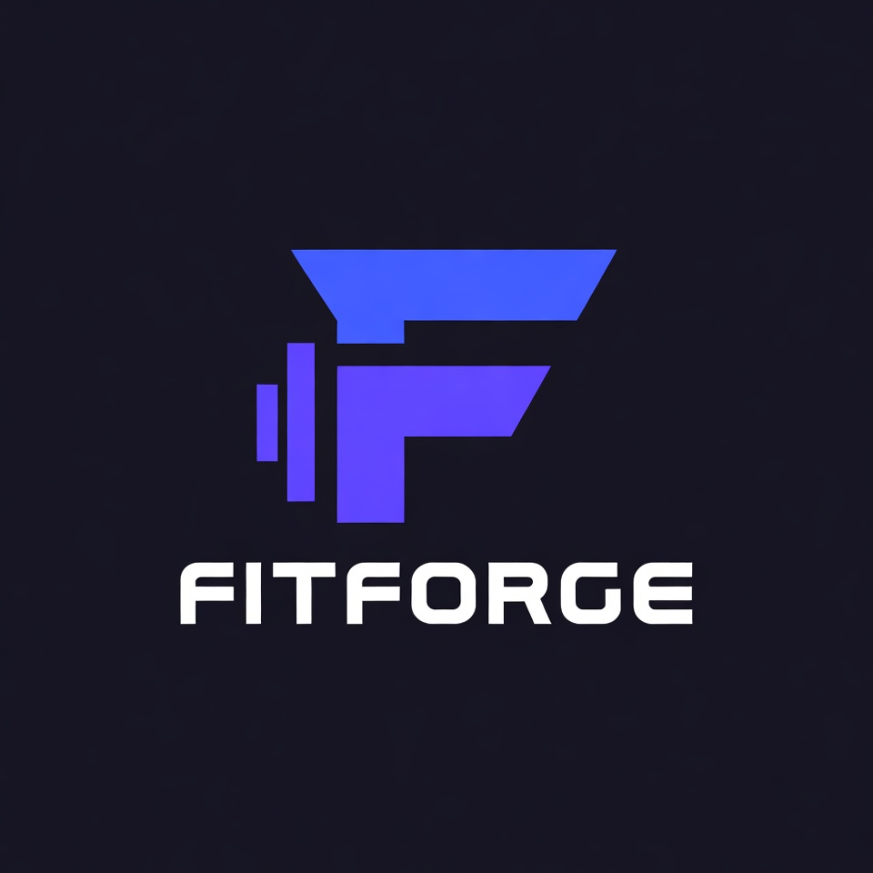

# FitForge 💪

A modern health and fitness application that combines personalized workout plans, nutrition tracking, and AI-powered coaching to help users achieve their fitness goals.



## 🌟 Features

- **AI Coach**: Personalized fitness guidance and recommendations
- **Workout Management**: Custom workout plans, exercise tracking, and session management
- **Nutrition Tracking**: Meal planning, calorie counting, and dietary goal management
- **Progress Monitoring**: Weight tracking, workout statistics, and performance analytics
- **Subscription System**: Free and premium tiers with Stripe integration
- **User Profiles**: Comprehensive user data including goals, preferences, and progress history

## 🎨 Design

- **Modern UI**: Vibrant color scheme with Electric Blue (#2978FF) and Neon Pink (#FF4EC4)
- **Dark Theme**: Cool dark mode with Dark Charcoal (#121212) background
- **Responsive**: Works perfectly on desktop, tablet, and mobile devices
- **Custom Logo**: Integrated throughout the application

## 🚀 Tech Stack

### Backend
- **Node.js** with Express.js
- **MongoDB** with Mongoose ODM
- **JWT** authentication
- **Stripe** payment processing
- **bcryptjs** for password hashing

### Frontend
- **React 18** with functional components and hooks
- **React Router DOM v6** for navigation
- **React Query** for server state management
- **Axios** for API calls
- **React Hot Toast** for notifications
- **Lucide React** for icons

## 🏃‍♂️ Quick Start

### Development

1. **Install dependencies**:
   ```bash
   npm install
   cd client && npm install
   ```

2. **Set up environment variables**:
   ```bash
   cp .env.example .env
   # Add your MongoDB URI, JWT secret, and Stripe keys
   ```

3. **Start the development servers**:
   ```bash
   # Backend (port 5000)
   npm run dev
   
   # Frontend (port 3000)
   cd client && npm start
   ```

4. **Open your browser**: `http://localhost:3000`

### Production

1. **Build the client**:
   ```bash
   npm run build
   ```

2. **Start the production server**:
   ```bash
   npm start
   ```

## 🌐 Deployment

This app is ready to deploy to:
- **Frontend**: Vercel, Netlify
- **Backend**: Railway, Render, Heroku
- **Database**: MongoDB Atlas

See `DEPLOYMENT.md` for detailed deployment instructions.

## 📱 User Types

- **Regular Users**: Basic features, workout tracking, limited AI coaching
- **Premium Users**: Full AI coach access, advanced analytics, premium content
- **Admins**: Administrative dashboard for user management

## 🔐 Environment Variables

```bash
# Database
MONGODB_URI=your_mongodb_connection_string

# Authentication
JWT_SECRET=your_jwt_secret

# Server
PORT=5000
NODE_ENV=development

# Stripe
STRIPE_SECRET_KEY=your_stripe_secret_key
REACT_APP_STRIPE_PUBLISHABLE_KEY=your_stripe_publishable_key

# API URL (for production)
REACT_APP_API_URL=your_backend_url
```

## 📄 License

MIT License - feel free to use this project for your own fitness applications!

## 🤝 Contributing

1. Fork the repository
2. Create your feature branch (`git checkout -b feature/AmazingFeature`)
3. Commit your changes (`git commit -m 'Add some AmazingFeature'`)
4. Push to the branch (`git push origin feature/AmazingFeature`)
5. Open a Pull Request

---

**Built with ❤️ for fitness enthusiasts everywhere!**